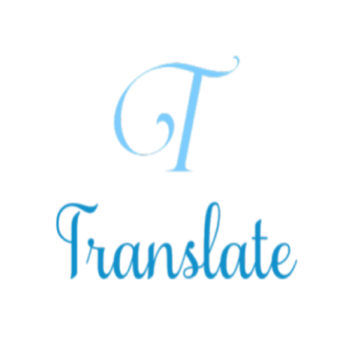
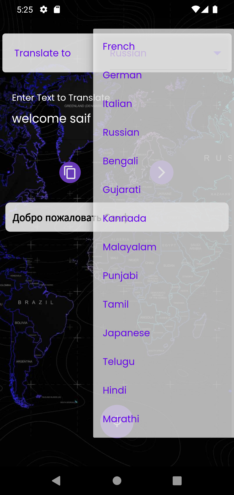
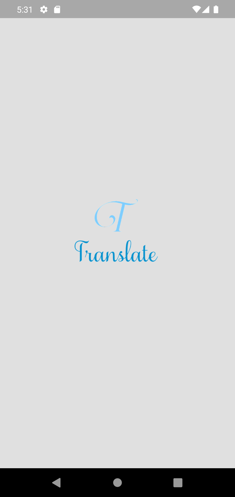
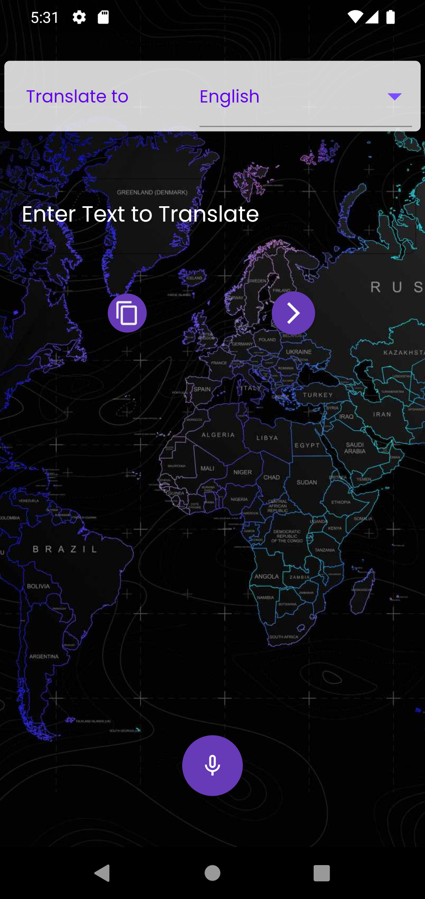
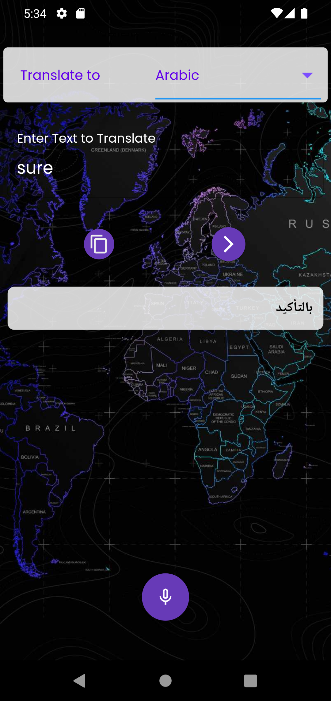
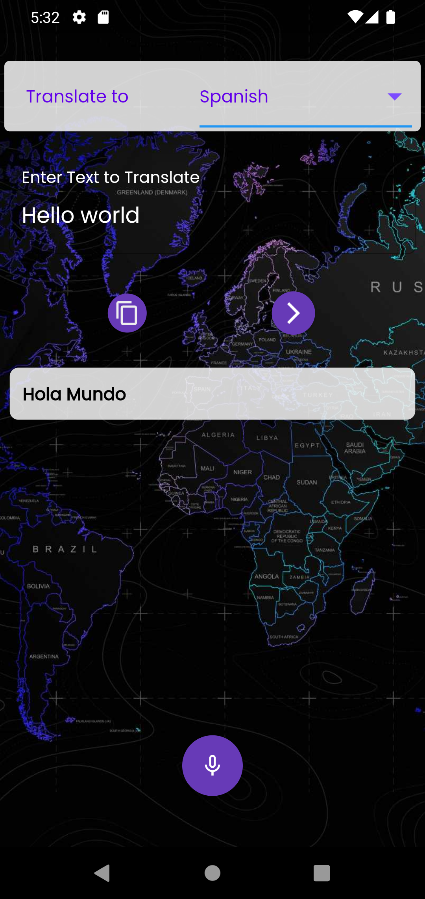
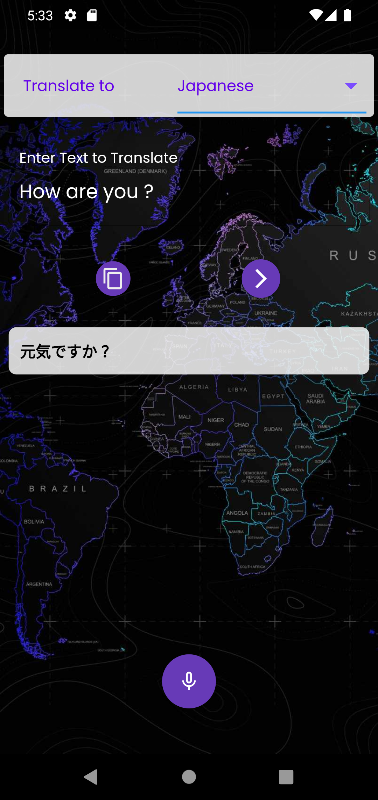
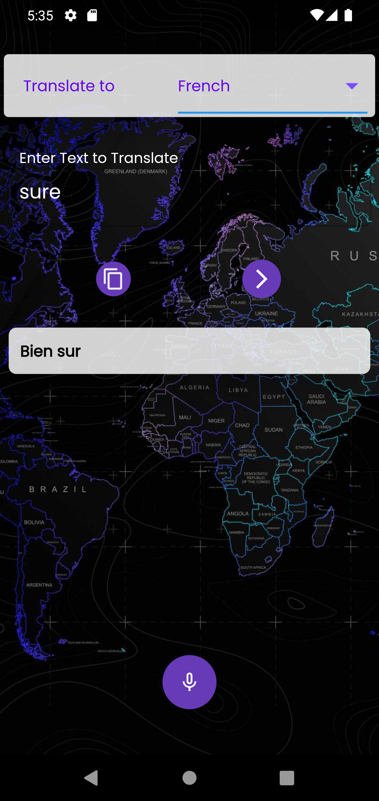

<<<<<<< HEAD
# translate

 

  

<h3 align="center">Translation app</h3>

  

a simple app for translation and talk the the translation
     
    <a href="https://github.com/AbdullahAlSalah-SE/flutter_task_manager_layout"><strong>Explore the docs »</strong></a>
     
     
    <a href="https://github.com/AbdullahAlSalah-SE/flutter_task_manager_layout">View Demo</a>
    ·
    <a href="https://github.com/AbdullahAlSalah-SE/flutter_task_manager_layout">Report Bug</a>
    ·
    <a href="https://github.com/AbdullahAlSalah-SE/flutter_task_manager_layout">Request Feature</a>
  

Translation app

     

<b>simple translation app </b>

## Benfit👻
- [🖥] # Screens 🖥
- [🆗]  HomeScreen

--------------------------------
- [🖥] # Deal With 🖥
- [x] Deal With Shared Prefs
- [x] Deal With translator package
- [x] Deal With firebase
- [x] Deal With flutter_speed_dial
- [x] Deal With speech_to_text
------------------------------

## Snapshots

| Languages                                      |   Splash Screen                      |
|--------------------------------------------------|---------------------------------------|
||  |

| Home Screen                                           | Create Tickect Screen         |
|--------------------------------------------------|---------------------------------------|
|       |  |

| Example 1                                           | Example 2         |
|--------------------------------------------------|---------------------------------------|
|       |  |

| Example 3                                           | Example 4         |
|--------------------------------------------------|---------------------------------------|
|       |  |

| Example 5                                        |        
|--------------------------------------------------|
|        |